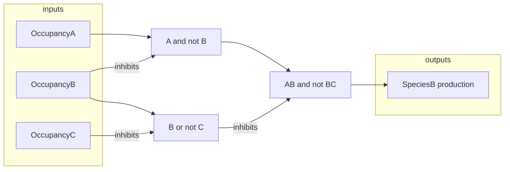
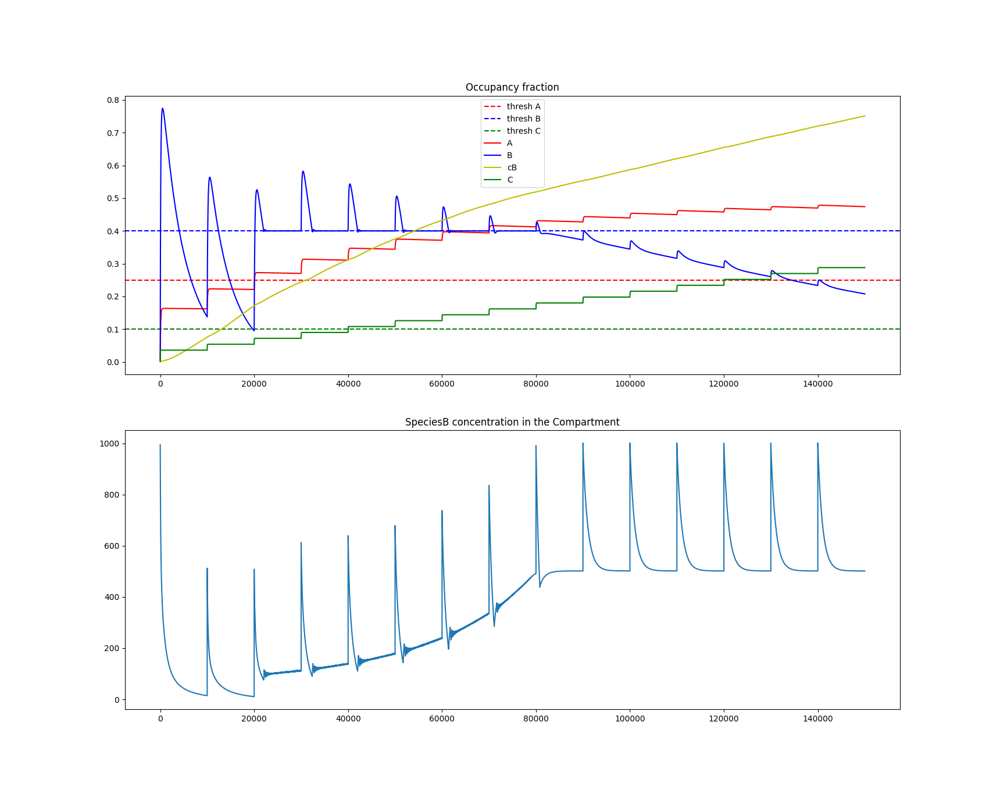

# Cell in a concentration profile

This is a simple model to demonstrate an effect of changing PK profiles on 
a cellular pathway.
It is a single cell in a single compartment model.
The cell has a simple pathway, which results or not in a production of a species.
There is no metabolic model, either produces or not.

## Species

We consider 5 distinct free species and 3 corresponding receptors.
Species _A_, _cA_ both bind to receptor A, 
species _B_ and _cB_ both bind to receptor B,
and species _C_ is a sole ligand for receptor C.

Species are defines as an enumeration in `compartment.SpecieType`.
Each has a set of properties _kon_, _koff_, _decay_ which determine the 
following (for a single time tick):

- _kon . [SpeciesX] . freeReceptorsX . timescale_ : gives the number of 
    molecules X that bind to a free receptor X on the cell and are removed 
    from the compartment
- _koff . boundSpeciesX . timescale_ : gives the number of bound species X 
    that unbind from a receptor X and return to the compartment
- _decay . compSpeciesX_ : gives the number of free species removed from the 
    compartment due to decay

Note that kinetic processes related to receptor binding-unbinding are rescaled 
using a `timescale` parameter. 
This is a pure convenience multiplier to adjust the values and see a reasonable 
dynamics within the simulated time window.

## Compartment

Besides gradual species decay mentioned above, the compartment has the following
important methods. 

A species quantity can be injected using a function `inject()`.
The number of injected molecules is determined by the `injection` dictionary 
provided to the `Compartment` constructor.
The numbers in the `injection` attribute can be modified on the instance.

Function `update_species_decay()` simply performs one decay tick 
(no timescale parameter used here).

## Pathway

Logical model of the pathway is shown in the diagram below.

The inputs are occupancy levels of the receptors _A_, _B_, and _C_.
Fraction of receptors bound to the species _A_, _B_, and _C_ are computed.
If occupation fraction is above threshold, the node is _True_.

Note that _cA_ and _cB_ are competitors to _A_ and _B_ and only modulate their 
action, by blocking the free receptors.

The set of inputs thresholds is an argument to `Pathway` constructor.
The thresholds can be modified on the instance.

If the last node, `[AB and not BC] == True`, then _SpeciesB_ is produced by the 
cell at constant rate and released to the Compartment.

`Pathway` has two basic methods, `update_inputs()`, which takes inputs occupancy 
fractions as argument, and updates the inputs states.

The other method (property) is `output`, which returns the current state of 
the `[AB and not BC]` note,`True` or `False`, driving or not the production.

## Occupancy

`Occupancy` class manages the occupancy state of each receptor type, and keeps
information about the amount of ligand and its competitor.

`update()` function takes ligand label and the change in bound molecules as the 
arguments, and updates the state of the receptor type.

`occ_ratio()` returns the occupancy fraction for a given species type.

The actual on/off kinetics computation is performed by the 
`Cell.update_occupancy()` method.

## Cell

`Cell` constructor takes the pathway (with thresholds defined) and a dictionary 
with count of surface receptors for each species type.

`Cell` aggregates the occupancies of all relevant receptors (on its surface), 
and manages their updated state by `update_occupancy()` method. The method 
communicates the change to the compartment and conserves the number of 
molecules in the system. 
That is, bound molecules are removed from the compartment, released are 
returned to it.

The `production()` method returns the quantity of `SpeciesB` produced during one 
time tick, which is simply `True`/`False` modulated by the 
`production_rate` variable.

## Main

The main module is a rudimentary entry point, to run the model simulation as a 
simple script and plot the occupancy rates.

In the first half of the script, it is possible to adjust the parameters.

If run, the output looks as follows

There, we can see that initially, the pathway yields no production and `SpeciesB` 
occupancy drops after every injection, as the species decays.

When `SpeciesA` crosses the threshold, the pathway produces `SpeciesB` as long as 
`occ(SpeciesB) <= threshold B`, which is a sufficient production rate to maintain 
the occupancy level.

The concentration of `SpeciesB` in the compartment steadily increases between the 
peaks, but the occupancy fraction stalls because of the `SpeciescB` competition.

When `SpeciesC` crosses the threshold, it does not have any additional effect.

As `SpeciescB` increases with slow injections, it replaces `SpeciesB` at the 
receptors (`SpeciescB` has a higher affinity).
As `SpeciesB` drops below the threshold, and does not oscillate around 
the threshold, the production of `SpeciesB` becomes constant.
This allows for local plateaux to form between the `SpeciesB` concentration 
spikes in the compartments.